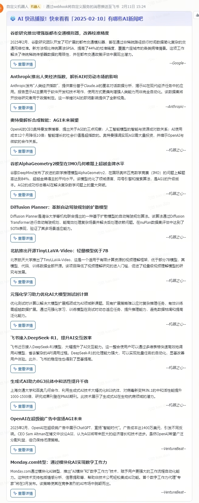

# AI News Robot

一个基于Python的AI新闻聚合和推送机器人,可以自动抓取、总结和推送AI领域的最新新闻。

## 功能特点

- 自动抓取多个AI相关网站的新闻
- 使用GPT-4进行新闻内容摘要
- 通过飞书机器人推送消息
- 支持定时任务自动运行
- 多源新闻聚合(OpenAI、DeepMind、Google、Anthropic等)
- 智能评分系统过滤新闻质量
- 支持中英文新闻处理

## 支持的新闻源

- OpenAI Blog
- DeepMind Blog 
- Google Research Blog
- Google Technology Blog
- Anthropic Blog
- 机器之心
- 小互AI
- VentureBeat AI

## 安装要求

- Python 3.10+
- Chrome浏览器(用于网页抓取)
- 依赖包:
  - selenium
  - requests
  - beautifulsoup4
  - openai
  - schedule
  - pydantic
  - python-dateutil

## 配置说明

创建`config.json`文件，包含以下配置项：

```json
{
    "feishu_webhook": {
        "group": "https://open.feishu.cn/open-apis/bot/v2/hook/your-group-webhook",
        "test": "https://open.feishu.cn/open-apis/bot/v2/hook/your-test-webhook"
    },
    "openai": {
        "api_key": "sk-xxxxxxxxxxxxxxxxxxxxxxxxxxxxxxxxxxxxxxxxxxxxxxxx",
        "base_url": "https://api.openai.com/v1",
        "model": "gpt-4-turbo-preview"
    },
    "serper": {
        "api_key": "your-serper-api-key",
        "base_url": "https://api.serper.dev/search"
    },
    "schedule": {
        "time": "08:00",
        "timezone": "Asia/Shanghai"
    }

}
```

### 配置项说明

- `feishu_webhook`: 飞书机器人配置
  - `group`: 生产环境群聊机器人webhook地址
  - `test`: 测试环境机器人webhook地址
- `openai`: OpenAI API配置
  - `api_key`: OpenAI API密钥
  - `base_url`: API基础URL
  - `model`: 使用的模型名称
- `serper`: Serper搜索API配置
  - `api_key`: Serper API密钥
  - `base_url`: API基础URL
- `schedule`: 定时任务配置
  - `time`: 每日执行时间
  - `timezone`: 时区设置


## 功能演示

### 新闻推送效果



